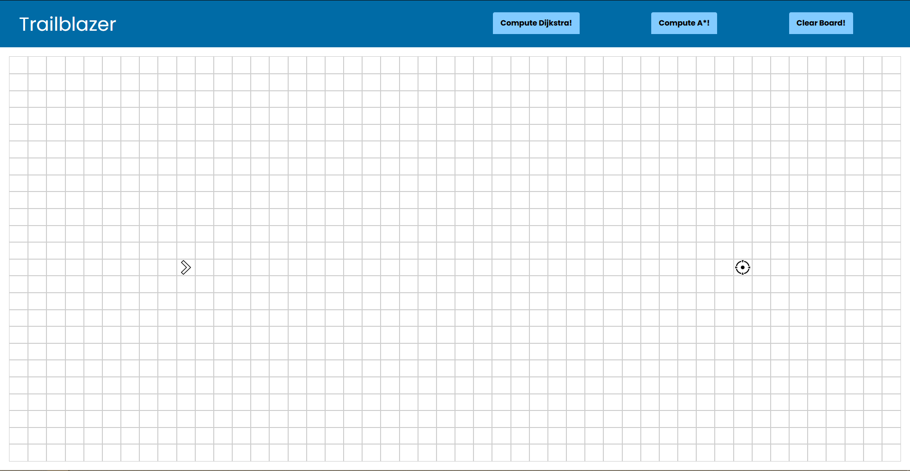
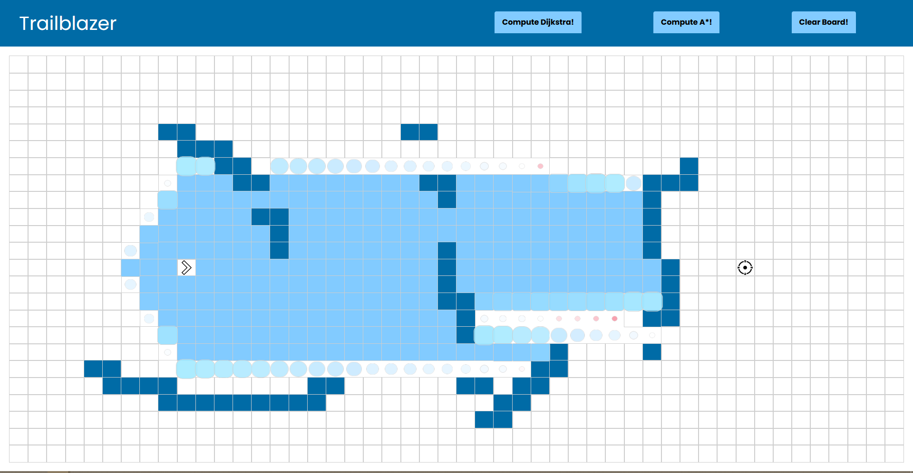
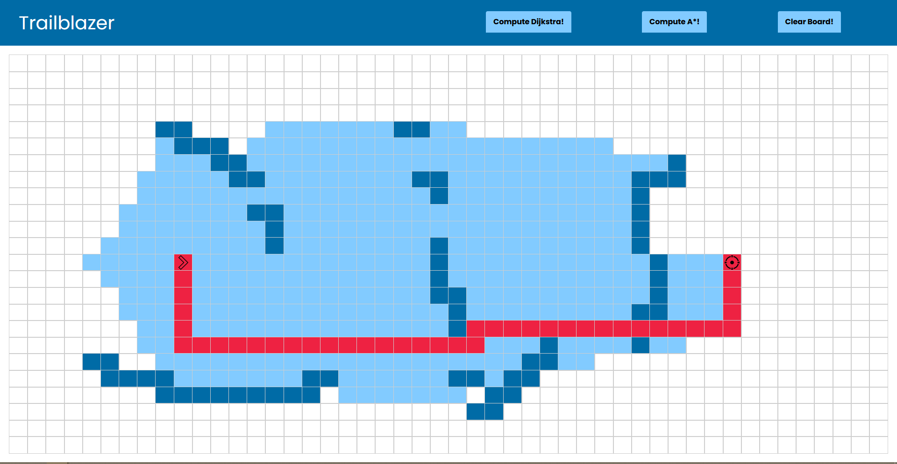

# Trailblazer - A Pathfinding Algorithm Simulator!

"Navigate this digital labyrinth with ease: Explore, simulate, and witness the power of pathfinding algorithms in action with this interactive React web app."

This project allows users to engage with an interactive map, enabling them to draw walls and obstacles. The app offers a selection of pathfinding algorithms to choose from, providing a hands-on experience of their unique functionalities. As the algorithm runs, the app visually animates the process, allowing users to observe how the algorithm navigates the map. Upon completion, the app presents the discovered quickest path, showcasing the effectiveness of the chosen algorithm. Immerse yourself in the world of pathfinding algorithms and explore their capabilities through this informative and interactive web app.


## Demo

https://trailblazer.jacobmutton.tech

## Screenshots





## Run Locally

Clone the project

```bash
  git clone https://github.com/jmutton2/trailblazer
```

Go to the project directory

```bash
  cd trailblazer
```

Install dependencies

```bash
  npm install
```

Start the app

```bash
  npm run start
```

